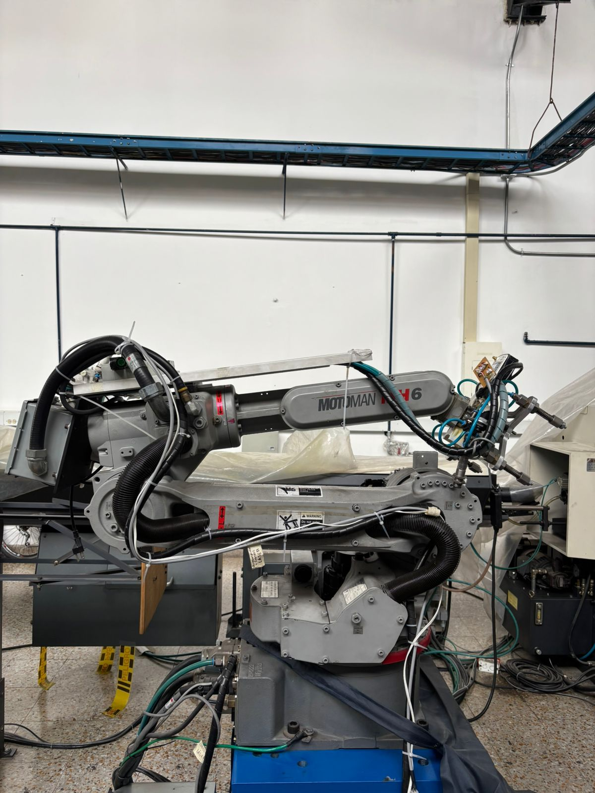
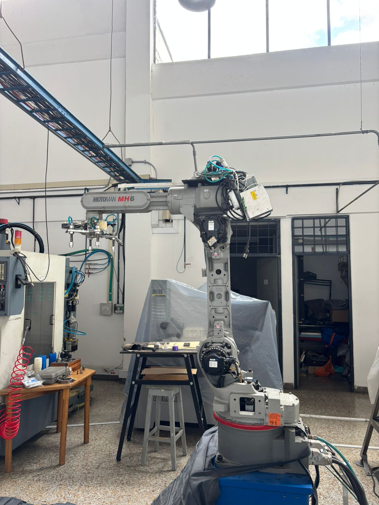
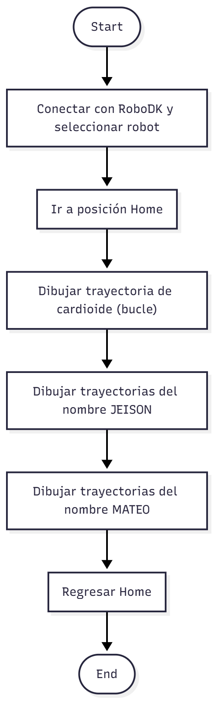

# Lab-02-Robotica-2025-2
Laboratorio 2 de Robótica 2025-2s, realizado por Jeison Diaz y Mateo Ramos

# Integrantes
1. Jeison Nicolás Diaz Arciniegas [jediazar@unal.co](JeisonD0819)
2. Mateo Ramos Cujer [mramoscu@unal.edu.co](MateoKGR)

# Informe

Indice:
1. [Cuadro comparativo](#cuadro-comparativo)
2. [Descripción de las configuraciones home1 y home2](#descripcion-config)
3. [Procedimiento detallado](#procedimiento)
4. [Explicación completa](#explicacion)
5. [Descripción funcionalidades RoboDK](#descripcion-funciones)
6. [Análisis comparativo RoboDK y RobotStudio](#analisis)
7. [Diagrama de flujo](#diagrama)
8. [Plano de planta](#planos)
9. [Código desarrollado](#codigo)
10. [Videos simulación e implementación](#videos)

## Cuadro comparativo

| Característica | **Motoman MH6 (Yaskawa)** | **ABB IRB140** |
|----------------|----------------------------|----------------|
| **Fabricante** | Yaskawa Motoman | ABB Robotics |
| **Grados de libertad (DOF)** | 6 | 6 |
| **Capacidad de carga máxima (Payload)** | 6 kg | 6 kg |
| **Alcance máximo** | 1,371 mm | 810 mm |
| **Repetibilidad (Precisión de posicionamiento)** | ±0.08 mm | ±0.03 mm |
| **Peso del manipulador** | 130 kg | 98 kg |
| **Rango de movimiento (articulaciones)** | S: ±170°, L: +155°/-90°, U: +250°/-175°, R: ±200°, B: ±150°, T: ±360° | J1: ±160°, J2: +110°/-110°, J3: +230°/-60°, J4: ±200°, J5: ±115°, J6: ±400° |
| **Velocidad máxima conjunta (aprox.)** | Hasta 230°/s (dependiendo del eje) | Hasta 320°/s (dependiendo del eje) |
| **Montaje** | Piso, pared, techo o invertido | Piso, pared, techo o invertido |
| **Controlador** | DX100 / DX200 | IRC5 Compact |
| **Aplicaciones típicas** | Manipulación de materiales, soldadura por arco, paletizado, ensamblaje, corte | Ensamblaje, manipulación de materiales, atornillado, laboratorio, empaquetado |
| **Tipo de energía** | Eléctrico (servomotores AC) | Eléctrico (servomotores AC) |
| **Comunicación con software** | Compatible con RoboDK, MotoSim, MotoCom | Compatible con RobotStudio |
| **Ambiente operativo** | 0–45°C, IP54 (IP67 opcional en muñeca) | 0–45°C, IP54 (IP67 en muñeca opcional) |
| **Ventajas destacadas** | Mayor alcance, buena relación peso/rango, versátil en montaje | Alta precisión, tamaño compacto, excelente para tareas de laboratorio |
| **Limitaciones** | Menor precisión que el IRB140 | Menor alcance y carga útil limitada a 6 kg |
| **Año de introducción** | ~2005 | ~2004 |

## Descripción de las configuraciones home1 y home2




## Procedimiento detallado
Antes de realizar cualquier movimiento, es importante tener en cuenta los siguientes pasos de seguridad y configuración:
Primero, se debe **desactivar el botón de seguridad o parada de emergencia**. Luego, es necesario **activar los servomotores** presionando el botón **“SERVO ON READY”**.  
Además, el **teach pendant** debe estar en modo **“TEACH”**, el cual permite realizar trayectorias manuales.
Posteriormente, se debe presionar el botón **“COORD”**, que permite alternar entre el modo de movimiento **articular** o **lineal**.  
Si se selecciona el modo **articular**, en la parte superior de la pantalla aparecerá un símbolo de un robot.  
En cambio, si se selecciona el modo **lineal**, se mostrará un sistema de coordenadas.

Una vez definido el modo de movimiento, se pueden realizar desplazamientos utilizando los botones correspondientes a los ejes **X**, **Y** y **Z**.  
Es importante tener en cuenta que las **articulaciones 7 y 8** son independientes de estas formas de movimiento del robot.
## Explicación completa
## Descripción funcionalidades RoboDK
RoboDK es una plataforma de simulación y programación *offline* de robots industriales que permite desarrollar, probar y optimizar trayectorias sin necesidad de utilizar el robot físico.  

### Funcionalidades principales

- **Simulación de trayectorias:** permite crear y visualizar movimientos del robot en un entorno 3D, evaluando posibles colisiones y alcances.  
- **Programación offline:** se pueden generar programas compatibles con múltiples marcas de robots (como KUKA, ABB, Fanuc o UR) directamente desde la interfaz.  
- **Integración CAD/CAM:** facilita importar modelos CAD para realizar trayectorias de mecanizado, soldadura o pulido.  
- **Control y comunicación:** soporta conexión en tiempo real con el robot físico mediante protocolos estándar.  
- **Personalización mediante scripts:** admite el uso de Python para automatizar rutinas y definir trayectorias paramétricas.  

RoboDK puede comunicarse con el manipulador de dos maneras:

1. **Programación offline:**  
   En este modo, RoboDK genera el código del programa compatible con el lenguaje del fabricante del robot (por ejemplo: KUKA, ABB, Fanuc, UR, Mitsubishi, entre otros).  
   Este archivo se transfiere manualmente al controlador del robot, donde se ejecuta sin necesidad de mantener una conexión activa con el software.

2. **Control online (en tiempo real):**  
   RoboDK puede establecer una conexión directa con el robot físico mediante una red Ethernet o protocolo TCP/IP.  
   A través de esta comunicación, el software envía las instrucciones al controlador para mover el robot en tiempo real.  
   Para ello, utiliza **drivers específicos** para cada marca de robot, permitiendo enviar comandos, actualizar posiciones y ejecutar programas desde la interfaz de RoboDK o mediante scripts en Python.

En ambos casos, RoboDK actúa como un intermediario entre el entorno virtual de simulación y el controlador físico del robot, garantizando que los movimientos sean precisos, seguros y reproducibles.

## Análisis comparativo RoboDK y RobotStudio
## Diagrama de flujo
Se adjunta el diagrama de flujo del el codigo final

## Plano de planta

## Código desarrollado

Este programa en Python utiliza la API de RoboDK para controlar un robot industrial. Establece la conexión con el robot, configura su marco de trabajo y genera movimientos que dibujan una figura tipo cardioide y las letras JEISON y MATEO. Combina cálculos matemáticos con comandos de movimiento para ejecutar trayectorias precisas dentro del entorno de simulación.

```python

from robodk.robolink import *    # API para comunicarte con RoboDK
from robodk.robomath import *    # Funciones matemáticas
import math

#------------------------------------------------
# 1) Conexión a RoboDK e inicialización
#------------------------------------------------
RDK = Robolink()

# Elegir un robot (si hay varios, aparece un popup)
robot = RDK.ItemUserPick("Selecciona un robot", ITEM_TYPE_ROBOT)
#if not robot.Valid():
#    raise Exception("No se ha seleccionado un robot válido.")

# Conectar al robot físico
#if not robot.Connect():
#    raise Exception("No se pudo conectar al robot. Verifica que esté en modo remoto y que la configuración sea correcta.")

# Confirmar conexión
#if not robot.ConnectedState():
#    raise Exception("El robot no está conectado correctamente. Revisa la conexión.")

print("Robot conectado correctamente.")

#------------------------------------------------
# 2) Cargar el Frame (ya existente) donde quieres dibujar
#------------------------------------------------
frame_name = "Frame_from_Target1"
frame = RDK.Item(frame_name, ITEM_TYPE_FRAME)
home = RDK.Item('Target_Home', ITEM_TYPE_TARGET)
m1 = frame.Pose()

if not frame.Valid():
    raise Exception(f'No se encontró el Frame "{frame_name}" en la estación.')

robot.setPoseFrame(frame)
robot.setPoseTool(robot.PoseTool())
robot.setSpeed(300)   # mm/s - Ajusta según necesites
robot.setRounding(5)  # blending (radio de curvatura)

#------------------------------------------------
# 3) Parámetros de la figura (cardioide)
#------------------------------------------------
num_points = 200
a = 100
offset_x = 300
offset_y = 0
z_surface = 0
z_safe = 50
offsetN = 50

robot.MoveJ(home)

#------------------------------------------------
# 4) Movimiento al centro en altura segura
#------------------------------------------------
robot.MoveJ(transl(0, 0, z_surface + z_safe))
robot.MoveL(transl(0, 0, 30))

#------------------------------------------------
# 5) Dibujar la figura cardioide
#------------------------------------------------
full_turn = 2 * math.pi

for i in range(num_points + 1):
    t = i / num_points
    theta = full_turn * t
    r = a * (1 + math.cos(theta))
    x = r * math.cos(theta)
    y = r * math.sin(theta)
    robot.MoveL(transl(x + offset_x, y + offset_y, z_surface))

robot.MoveL(transl(x + offset_x, y + offset_y, z_surface + z_safe))

#------------------------------------------------
# 6) Letras adicionales (JEISON y MATEO)
#------------------------------------------------
point1 = transl(-20 + offsetN, -180, 0)
point2 = transl(0 + offsetN, -200, 0)

# Figura J
robot.MoveL(transl(50 + offsetN, -200, 0))
robot.MoveL(transl(50 + offsetN, -160, 0))
robot.MoveL(transl(0 + offsetN, -160, 0))
robot.MoveL(transl(-15 + offsetN, -160, 0))
robot.MoveL(transl(-15 + offsetN, -190, 0))
robot.MoveL(transl(0 + offsetN, -190, 0))
robot.MoveL(transl(0 + offsetN, -190, 50))

# Figura E
robot.MoveL(transl(0 + offsetN, -200, 50))
robot.MoveL(transl(50 + offsetN, -100, 0))
robot.MoveL(transl(50 + offsetN, -140, 0))
robot.MoveL(transl(20 + offsetN, -140, 0))
robot.MoveL(transl(20 + offsetN, -100, 0))
robot.MoveL(transl(20 + offsetN, -140, 0))
robot.MoveL(transl(-20 + offsetN, -140, 0))
robot.MoveL(transl(-20 + offsetN, -100, 0))
robot.MoveL(transl(-20 + offsetN, -100, 50))

# Figura I
robot.MoveL(transl(50 + offsetN, -80, 0))
robot.MoveL(transl(-20 + offsetN, -80, 0))
robot.MoveL(transl(-20 + offsetN, -80, 50))

# Figura S
robot.MoveL(transl(50 + offsetN, -20, 0))
robot.MoveL(transl(50 + offsetN, -60, 0))
robot.MoveL(transl(20 + offsetN, -60, 0))
robot.MoveL(transl(20 + offsetN, -20, 0))
robot.MoveL(transl(-20 + offsetN, -20, 0))
robot.MoveL(transl(-20 + offsetN, -60, 0))
robot.MoveL(transl(-20 + offsetN, -60, 50))

# Figura O
robot.MoveL(transl(50 + offsetN, 0, 0))
robot.MoveL(transl(50 + offsetN, 40, 0))
robot.MoveL(transl(-20 + offsetN, 40, 0))
robot.MoveL(transl(-20 + offsetN, 0, 0))
robot.MoveL(transl(50 + offsetN, 0, 0))
robot.MoveL(transl(50 + offsetN, 0, 50))

# Figura N
robot.MoveL(transl(-20 + offsetN, 60, 0))
robot.MoveL(transl(50 + offsetN, 60, 0))
robot.MoveL(transl(-20 + offsetN, 100, 0))
robot.MoveL(transl(50 + offsetN, 100, 0))
robot.MoveL(transl(50 + offsetN, 100, 50))

# ======================
# MATEO
# ======================

# Figura M
robot.MoveL(transl(-110 + offsetN, -200, 0))
robot.MoveL(transl(-40 + offsetN, -200, 0))
robot.MoveL(transl(-70 + offsetN, -160, 0))
robot.MoveL(transl(-40 + offsetN, -120, 0))
robot.MoveL(transl(-110 + offsetN, -120, 0))
robot.MoveL(transl(-110 + offsetN, -120, 50))

# Figura A
robot.MoveL(transl(-110 + offsetN, -100, 0))
robot.MoveL(transl(-40 + offsetN, -60, 0))
robot.MoveL(transl(-110 + offsetN, -20, 0))
robot.MoveL(transl(-110 + offsetN, -20, 20))
robot.MoveL(transl(-70 + offsetN, -80, 0))
robot.MoveL(transl(-70 + offsetN, -40, 0))
robot.MoveL(transl(-70 + offsetN, -40, 50))

# Figura T
robot.MoveL(transl(-110 + offsetN, 20, 0))
robot.MoveL(transl(-40 + offsetN, 20, 0))
robot.MoveL(transl(-40 + offsetN, 0, 0))
robot.MoveL(transl(-40 + offsetN, 40, 0))
robot.MoveL(transl(-40 + offsetN, 40, 50))

robot.MoveL(transl(-110 + offsetN, 80, 0))
robot.MoveL(transl(-40 + offsetN, 80, 0))
robot.MoveL(transl(-40 + offsetN, 60, 0))
robot.MoveL(transl(-40 + offsetN, 100, 0))
robot.MoveL(transl(-40 + offsetN, 100, 50))

# Finalización
robot.MoveJ(transl(0, 0, z_surface + z_safe))
robot.MoveJ(home)

print(f"¡Figura (rosa polar) completada en el frame '{frame_name}'!")

```

## Videos simulación e implementación